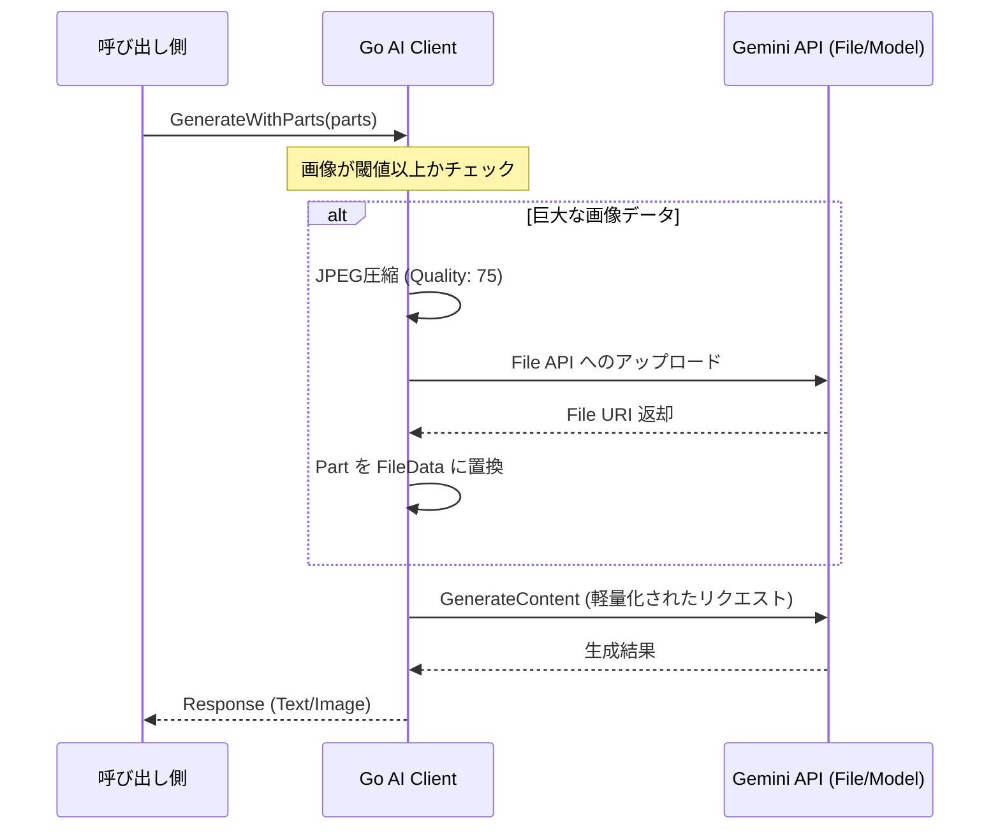

# ✨ Go AI Client

[](https://golang.org/)
[](https://golang.org/)
[](https://github.com/shouni/go-ai-client/tags)
[](https://opensource.org/licenses/MIT)

## 🎯 概要: Gemini APIのためのテンプレートベースAIクライアント

Go AI Client は、Go言語で Google **Gemini API** を利用するためのクライアントライブラリと、**テンプレートベースのプロンプト生成**ユーティリティを提供します。

本プロジェクトは、漫画生成や長文ドキュメント解析などの**重負荷なAI駆動ワークフロー**を安定して支えるために設計されています。

-----

## 💎 特徴と設計思想

### 🛡️ Stable Image Generation Pipeline 

Gemini API で画像を含むリクエスト（マルチモーダル生成）を行う際の最大の障壁である「Error 500 (Internal Error)」を徹底的に排除します。

### 🤖 堅牢なAIクライアント (`pkg/ai/gemini`)

* **File API 自動昇格:** `InlineData`（Base64）のサイズが閾値を超えた場合、ライブラリが内部で自動的に **Gemini File API** へアップロードします。
* **URI参照への置換:** アップロード後にURI参照形式へ置換して送信することで、巨大なペイロードによるAPIエラーを回避します。
* **高度なリトライ戦略:** 指数バックオフによる自動復旧。セーフティフィルタによるブロック時は即時停止する賢いリトライロジック。
* **決定論的な制御:** シード値 (`Seed`) の固定により、再現性のある画像・テキスト生成をサポート。

### 📝 柔軟なプロンプト管理 (`pkg/prompts`)

* **テンプレートキャッシュ:** 実行時のオーバーヘッドを最小化。
* **DI対応:** `Builder` インターフェースにより、テストやロジックの差し替えが容易。

---

## 🚀 インストール

```bash
go get github.com/shouni/go-ai-client/v2
```

### 🗝️ APIキーの設定

環境変数 `GEMINI_API_KEY` を設定してください。

```bash
export GEMINI_API_KEY="YOUR_API_KEY"
```

-----

## 💡 使用方法

### 画像を含むリクエストの例

ライブラリが自動で「圧縮」と「File API転送」を判断するため、呼び出し側はシンプルに保てます。

```go
client, _ := gemini.NewClientFromEnv(ctx)

// 画像とテキストを混在させたパーツ
parts := []*genai.Part{
    genai.NewPartFromText("このキャラのDNAを継承して新しいパネルを作って"),
    genai.NewPartFromData(largeImageData, "image/png"), // 巨大なデータも自動転送！
}

opts := gemini.ImageOptions{
    AspectRatio: "3:4",
    Seed:        genai.Ptr(int32(42)), 
}

resp, err := client.GenerateWithParts(ctx, "gemini-1.5-flash", parts, opts)

```

### 詳細設定 (`gemini.Config`)

| 設定項目 | 役割 | デフォルト値 |
| --- | --- | --- |
| **`Temperature`** | 応答の創造性 | `0.7` |
| **`MaxRetries`** | 最大リトライ回数 | `3` |
| **`InitialDelay`** | リトライ開始時の待機時間 | `30s` |

## 🏗️ 処理フロー



---

## 📂 プロジェクト構造

| ディレクトリ | 役割 |
| --- | --- |
| `cmd/` | **I/O層**: CLIエントリーポイント、フラグ解析、DIコンテナの構築。 |
| `pkg/ai/gemini` | **外部層**: Gemini APIとの通信、リトライ、決定論的パラメータ管理。 |
| `pkg/prompts` | **ロジック層**: プロンプトテンプレートの管理、データ埋め込み、モード切り替え。 |

### 📜 ライセンス (License)

このプロジェクトは [MIT License](https://opensource.org/licenses/MIT) の下で公開されています。
